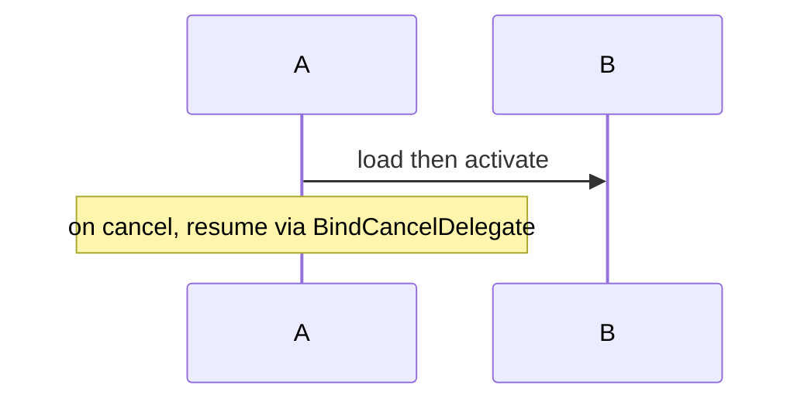
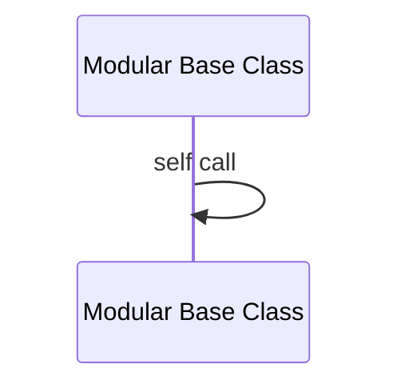
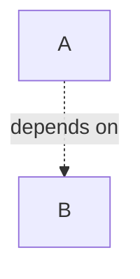

# Mermaid Diagram Authoring (Parser-Safe)

## Context
- Mandatory when writing Mermaid blocks (`graph`, `flowchart`, `sequenceDiagram`, `classDiagram`) into Markdown for external renderers (Zhihu, GitHub, mermaid.live) — parser strictness varies by renderer and version.
- Trigger on errors like `Expecting '+', '-', 'ACTOR', got 'participant_actor'` or `Unrecognized text`.

## 1. sequenceDiagram: Text Is Not Free Text
Message text (after `A->>B:`) and `Note` text are lexed, not swallowed verbatim. Arrow-like tokens inside them corrupt the lexer state, and the real parse error surfaces **several lines later** — never trust the reported line number blindly, but the offending token is always on a recent message/note line.

- **No Unicode arrows** (`→`, `←`, `⇒`) in message or note text — the lexer rejects them (`Unrecognized text`).
- **No ASCII arrows** (`->`, `-->`, `->>`) in message or note text — the lexer treats them as real arrow operators, desyncing the grammar (`Expecting ACTOR...`).
- Replace with words: `then`, `via`, `leads to`, or a colon.

## 2. Reserved Words as Participant IDs
Newer Mermaid (v10.9+/v11) added `actor` as a keyword for typed participants. An ID colliding with a keyword breaks parsing **with the error reported on a later unrelated line** — the most confusing failure mode.

- Never use `actor`, `participant`, `note`, `loop`, `end`, `rect` as a participant ID (case-insensitive risk — `Actor` also fails).
- Use short, collision-proof IDs (`MA`, `PC`, `GFCM`) and put the display name in the alias.

## 3. Special Characters in Aliases and Labels
- Avoid `*` in participant aliases — it is a grammar token (activation/creation), not literal text.
- Parentheses inside `classDiagram` relation labels (`: Layers(tag map)`) can break parsing — rephrase to `Layers: tag map`.
- Flowchart node text inside `[...]` is genuine free text: `F --> G[Push: HUD -> UI.Layer.Game]` is safe. Only sequenceDiagram messages/notes are lexed strictly.
- Full-width punctuation（，：）in labels is fine; ASCII `:` inside a `Note over X:` text is also fine — the first colon is the delimiter, the rest is text.

## 4. Dotted Arrows with Labels
The "dot-text-dot" arrow form `A -. label .-> B` is fragile with CJK text or dots in the label. Use the pipe form instead — it is the only universally accepted syntax:

## 5. Pre-Flight Checklist
Before publishing a doc with Mermaid:

- [ ] Every Mermaid block pasted into mermaid.live (or the target renderer) and rendered once.
- [ ] sequenceDiagram scanned for `→` / `->` in message and note text.
- [ ] Participant IDs scanned against the reserved-word list.
- [ ] Aliases scanned for `*` and other operator characters.
- [ ] Dotted arrows use `-.->|label|`, never `-. label .->`.

## Architecture

Mermaid diagrams in documentation are parsed by a two-stage lexer/grammar (jison); the lexer tokenizes the whole block before the grammar runs, so an illegal token in free-form-looking text desyncs all subsequent lines. The numbered sections above document which tokens are unsafe per diagram type.

## Data Flow

Author writes Mermaid source, the renderer's lexer tokenizes arrows/keywords first, then the grammar consumes tokens; a stray arrow or reserved word in text shifts the token stream, producing errors whose reported line lags the actual offending token.

## Key Claims

- **Lexer-first parsing**: Mermaid tokenizes before parsing, so arrow symbols and keywords inside message/note text corrupt the entire block — the reported error line is often downstream of the real cause.
- **Reserved-word participant IDs**: Using `actor`/`Actor` as a participant ID breaks newer Mermaid with a delayed, misleading error (`Expecting ACTOR, got participant_actor`).
- **Pipe-label arrows**: `-.->|label|` is the only dotted-arrow label syntax robust across renderers and CJK content.

## Edge Cases

- Zhihu does not render Mermaid at all — export images via mermaid.live; the strictness lessons still apply to the export step.
- `Note over A, B:` with two participants is fine, but keep note text free of arrows like any message text.
- ` ` inside notes and labels is supported; ` ` without the slash also works, but stay consistent.

## Boundaries

- The Mermaid Diagram Authoring guide covers authoring Mermaid that survives strict parsers; it does not cover Mermaid theming, config directives, or diagram-type selection.
- Renderer-specific quirks beyond the four rules above are out of scope — always verify on the target renderer.

## Evidence

- `UE5Skill` defined at `Source/Runtime/Engine/EngineTypes.h`
